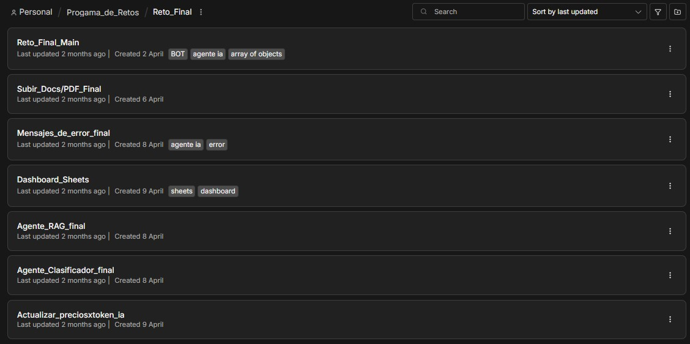

# n8n AI Workflow Automation System

This directory contains a complete AI-powered workflow automation system built with n8n. The system handles customer messages, classifies intent, uses a RAG (Retrieval-Augmented Generation) agent for property inquiries, and updates a Google Sheets dashboard for analytics.

## Workflows Included:

*   `reto-final-main.json`: The main entry point that receives messages from WhatsApp, normalizes data, and delegates to specific agents using an LLM supervisor.
*   `agente-rag.json`: A specialized RAG agent that answers real estate inquiries using a vector store (Pinecone) and documents (PDFs).
*   `agente-clasificador.json`: Handles complaints, urgent requests, and negative sentiment messages.
*   `dashboard-sheets.json`: Extracts metrics from Supabase and updates a Google Sheets dashboard for business analytics.
*   `subir-pdf.json`: An administrative workflow to upload PDF documents to the vector store.
*   `manejo-errores.json`: A global error handling workflow to log failures and notify administrators.
*   `actualizar-tokens.json`: A scheduled workflow to update AI model token pricing.

## Note on Credentials
All sensitive credentials, API keys, and phone numbers have been redacted (`YOUR_API_KEY`, `YOUR_WEBHOOK_ID`, etc.) for security. To import these workflows into your n8n instance, you must configure the corresponding credentials in your environment.

## Screenshots

